Here we see how to create a Three.JS scene with animated GLTF model bird that follows a path dictated by a 'curve'.  

This demo uses Three.js Gatsby.JS @React-Three/Fiber and JSX.
  
>You can visit the stand-alone version of this scene <a href="/followcurvedemo">here</a>

__***Getting Started.....***__

**Make a new page to hold the scene.  **
Navigate to /src/pages and create a new folder 'followcurvedemo' and make a new empty file  *index.js* inside it:


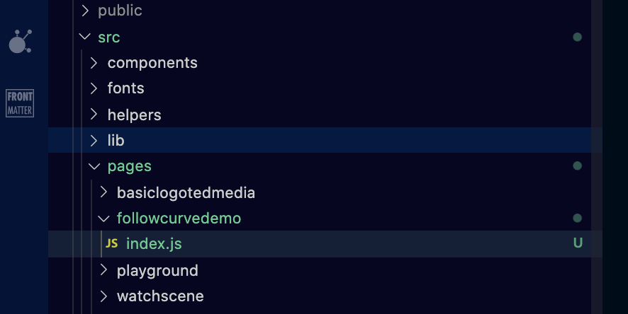

Now let's get a basic page to display by adding some starter content.  Edit the new index.js file and add:

```javascript
import React from 'react' 
import Layout from "../../components/layoutwide" 
  
const MyPage = (props) => (   
  <Layout displayHero={false}>    
      <div style={{ height: "500px", width: "100%",background:"yellow" }}>  
          Hello test 123
      </div> 
  </Layout> 
)
 
export default MyPage  
```  

Notice we call our new function MyPage but the name is irrelevant - the Gatsby page will use the default export.  The height and width are just guesswork for now.

**Test in local server** by using the *gatsby develop* command.  
>Using MDX with components has some 'issues', so we found that the regular gatsby develop command needs enhancing.  In *package.json*, we have this develop command to run instead which removes cache and allows debug inspector clients (including VS Code) to connect:

```bash
  "scripts": {
    "build": "gatsby build",
    "develop": "rm -rf .cache/caches/gatsby-plugin-mdx && gatsby develop --inspect",
    "start": "serve public/", 
  }
```
To run that command instead of gatsby develop, we use..
```bash
npm run develop
```  

Thanks to built in *Gatsby routing*, the page will automatically be served without any routing setup.  So, we can start the server and navigate to our new page <a target="_blank"   href='http://localhost:8000/followcurvedemo'>http://localhost:8000/followcurvedemo</a>

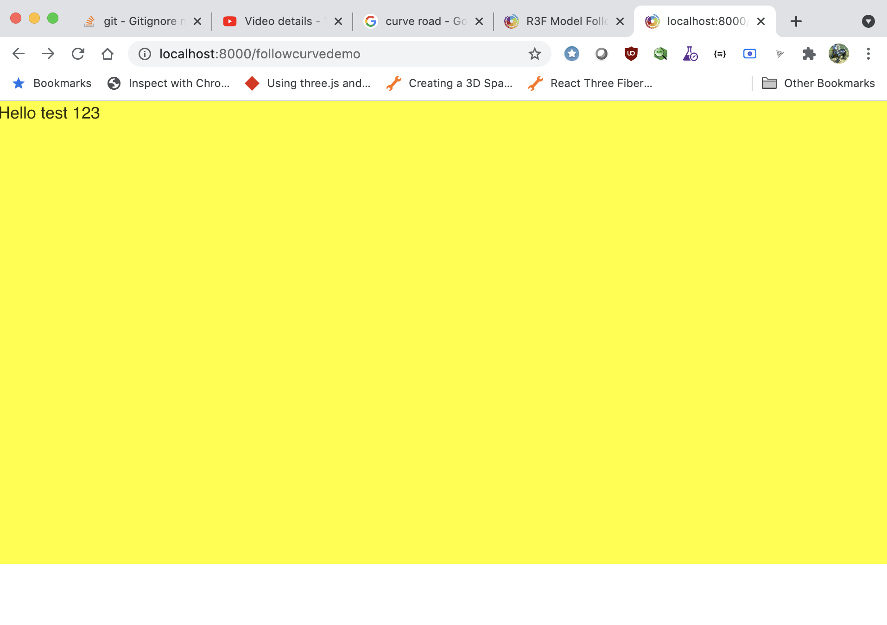

>Git is your friend!  Now that the basics are working, it makes sense to commit those changes to the GIT repo.  I prefer to commit whenever code is confirmed error free, as I find this can help narrow things down when identifying bugs.

Now lets get a react-three-fiber Three.js scene running instead, so edit the index.js to:
1.  create a **canvas** element (to display the three scene)
2.  add a **floor plane** (mesh)
3.  make a **light** (pointlight)

Like so:

```jsx
import React from 'react' 
import Layout from "../../components/layoutwide"  
import { Canvas } from "@react-three/fiber"
  
const MyPage = (props) => (   
  <Layout displayHero={false}>    
      <div  style={{ height: "500px", width: "100%",background:"yellow" }}>  
        <Canvas style={{ height: "100%", width: "100%" }}>

          <mesh receiveShadow rotation={[5, 0, 0]} position={[0, -1, 0]}>
            <planeBufferGeometry attach="geometry" args={[500, 500]} />
            <meshStandardMaterial attach="material" color="white" />
          </mesh>
          
          <pointLight position={[-10, 10, 10]} />

        </Canvas>
      </div> 
  </Layout> 
)
 
export default MyPage  

```

The main changes there were to add the Canvas declaration at the top:
```javascript
import { Canvas } from "@react-three/fiber" 
```

notice for the floor, we added a mesh 500x500 as a child of the Canvas
```jsx
<mesh receiveShadow rotation={[5, 0, 0]} position={[0, -1, 0]}>
  <planeBufferGeometry attach="geometry" args={[500, 500]} />
  <meshStandardMaterial attach="material" color="white" />
</mesh>

```

and a basic light was added to light the scene a little
```jsx
<pointLight position={[-10, 10, 10]} />
```

now the page should give us that new scene:

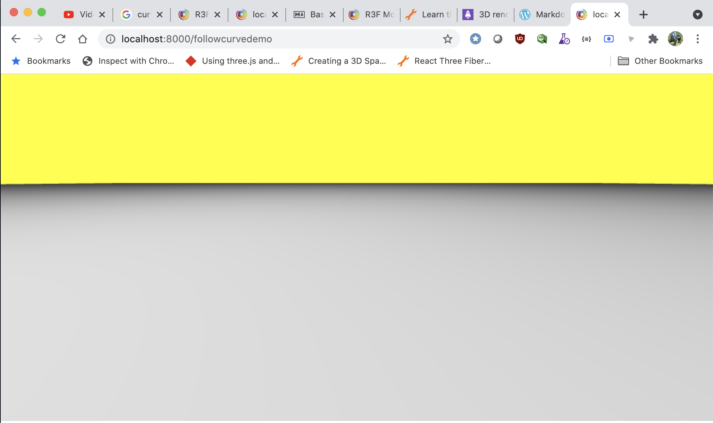

Success: The scene is rendering, the floor plane is visible. The 'back' of the Three.js scene is yellow:  that's from the holding div which was declared as yellow....
```javascript
const MyPage = (props) => (   
  <Layout displayHero={false}>    
      <div  style={{ height: "500px", width: "100%",background:"yellow" }}>  
```

>Did you know? This website's full source code is open and available for you to downlaod and use at your pleasure <a href="https://github.com/TedfordMedia/tedfordmedia">here</a>
  
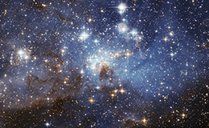
<h1>Stars for the background !</h1>

There is a super-easy way to build a nice Three.js background of STARS.  Just include the brilliant <a href="https://github.com/pmndrs/drei">@react-three/drei library</a> and add just 2 lines
```jsx
import { Stars } from '@react-three/drei';   //at the top

<Stars/>    //inside your <canvas
```

So the full code is now....

```jsx
import React from 'react' 
import Layout from "../../components/layoutwide"  
import { Canvas } from "@react-three/fiber"
import { Stars } from '@react-three/drei';
  
const MyPage = (props) => (   
  <Layout displayHero={false}>    
      <div  style={{ height: "500px", width: "100%",background:"black" }}>  
        <Canvas style={{ height: "100%", width: "100%" }}>

          <mesh receiveShadow rotation={[5, 0, 0]} position={[0, -1, 0]}>
            <planeBufferGeometry attach="geometry" args={[500, 500]} />
            <meshStandardMaterial attach="material" color="white" />
          </mesh>
          
          <pointLight position={[-10, 10, 10]} />

          <Stars/>

        </Canvas>
      </div> 
  </Layout> 
)
 
export default MyPage  
```

..also amended the holding div background color to black and to make the scene Full height with 100vh **not** 100%....

```jsx
<div  style={{ height: "100vh", width: "100%",background:"black" }}>  
```

Now we see the full height..

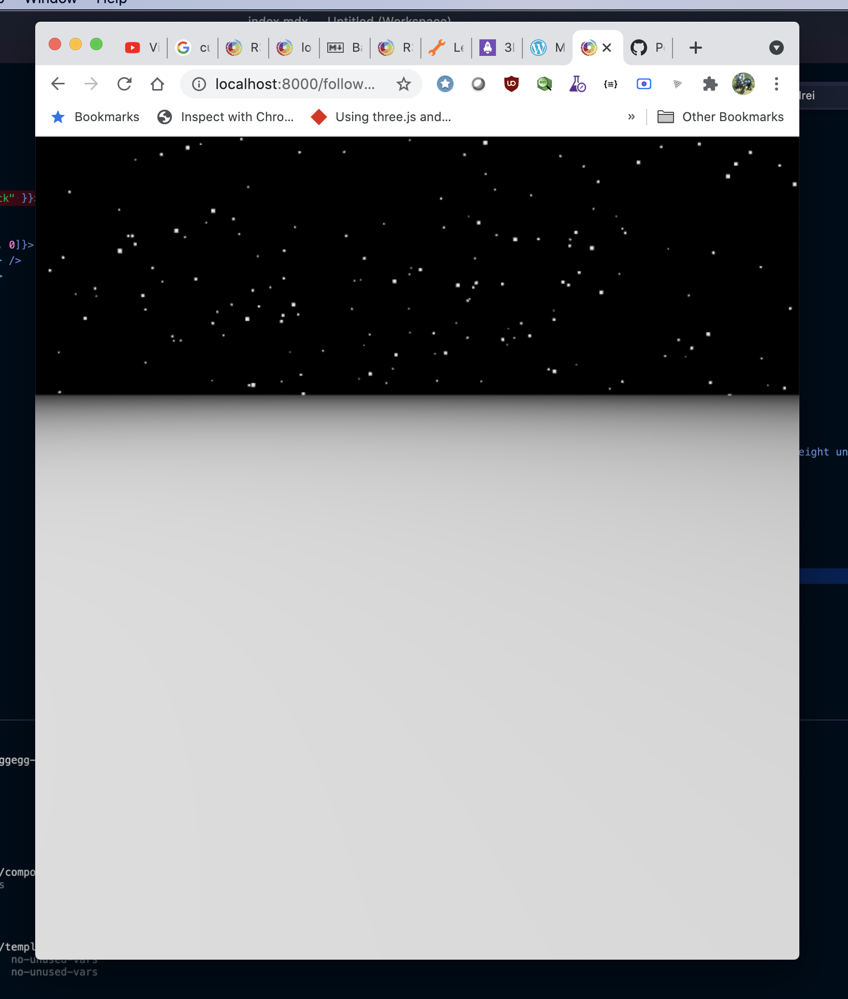

OK, next, we need to add a curved path, so we'll use the <a href="https://threejs.org/docs/#api/en/extras/curves/CatmullRomCurve3">Three.JS CatmullRomCurve3</a>

Here we se the start of a simple curve

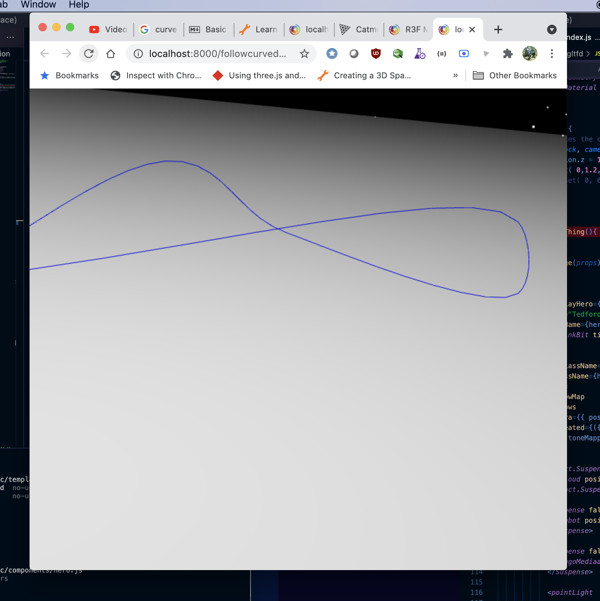

That's a good start.  Here is the code that created that.  First, add a new function in index.js called **TheCurveThing**


```jsx
function TheCurveThing(){
 const [ref] = useRef() 

  const curve = new THREE.CatmullRomCurve3( [
    new THREE.Vector3( -10, 0, 6 ),
    new THREE.Vector3( -5, 3, 5 ),
    new THREE.Vector3( 0, 2, 0 ),
    new THREE.Vector3( 5, 0, 5 ),
    new THREE.Vector3( 5, 2, 5 ),
    new THREE.Vector3( -10, 0, 6 ),
  ] );
  
  const points = curve.getPoints( 50 );
  const lineGeometry = new THREE.BufferGeometry().setFromPoints( points ); 

  return (
    <> 
      <group position={[0, 1, -1]}> 
        <line position={[0, 0, 0]} ref={ref} geometry={lineGeometry}>
          <lineBasicMaterial attach="material" color={'blue'} linewidth={10} linecap={'round'} linejoin={'round'} />
        </line>  
      </group> 
    </>
  ) 
}
```

and simply drop **TheCurveThing** inside the Canvas tags:

```jsx
<Canvas camera={{ position: [-10, 0, 25], fov: 30 }} style={{ height: "100%", width: "100%" }}>

  <mesh receiveShadow rotation={[5, 0, 0]} position={[0, -1, 0]}>
    <planeBufferGeometry attach="geometry" args={[500, 500]} />
    <meshStandardMaterial attach="material" color="white" />
  </mesh>

  <pointLight position={[-10, 10, 10]} />

  <Stars/>
  <TheCurveThing/>
</Canvas> 
```

Notice we also added a camera specification to the canvas so we can see more of the curve.
```jsx
  <Canvas camera={{ position: [-10, 0, 25], fov: 30 }} style={{ height: "100%", width: "100%" }}>
```  
  
  
**GLB/GLTF Model **

To add an animated model, we found <a href='https://sketchfab.com/3d-models/flying-machine-40bdbc05e69b464baca9fe547280e522'>this</a>  on Sketchfab by <a  href='https://sketchfab.com/cyamahat'>**cyamahat** </a>and used here under CC Attribution License <a target='__blank' href='https://sketchfab.com/3d-models/flying-machine-40bdbc05e69b464baca9fe547280e522'></a> 
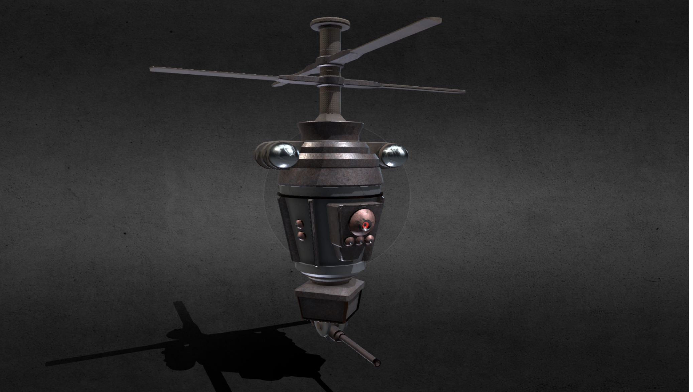

To get the model ready, we downloaded the GLTF and then we have to manipulate it a little in Blender to make it a .glb.  Start with a blank Blender scene, import the gltf:

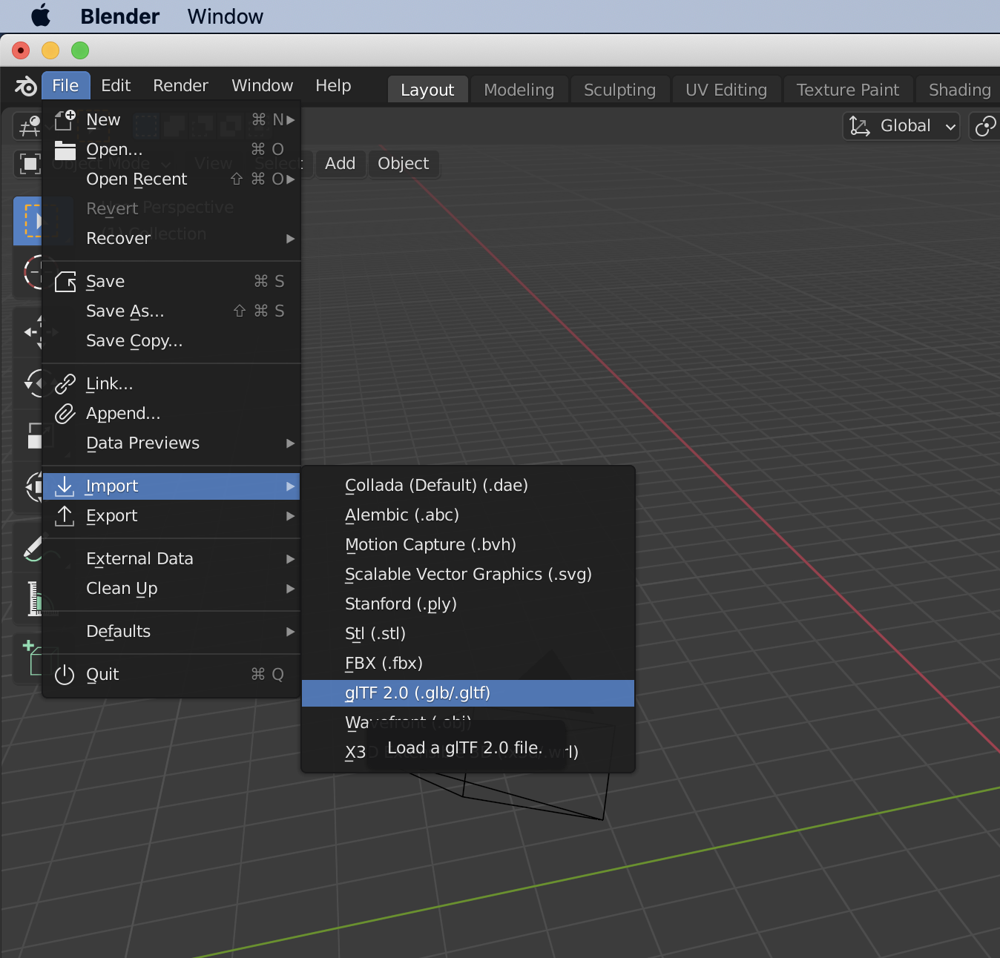

and export then just export it, as flyingmachine.glb
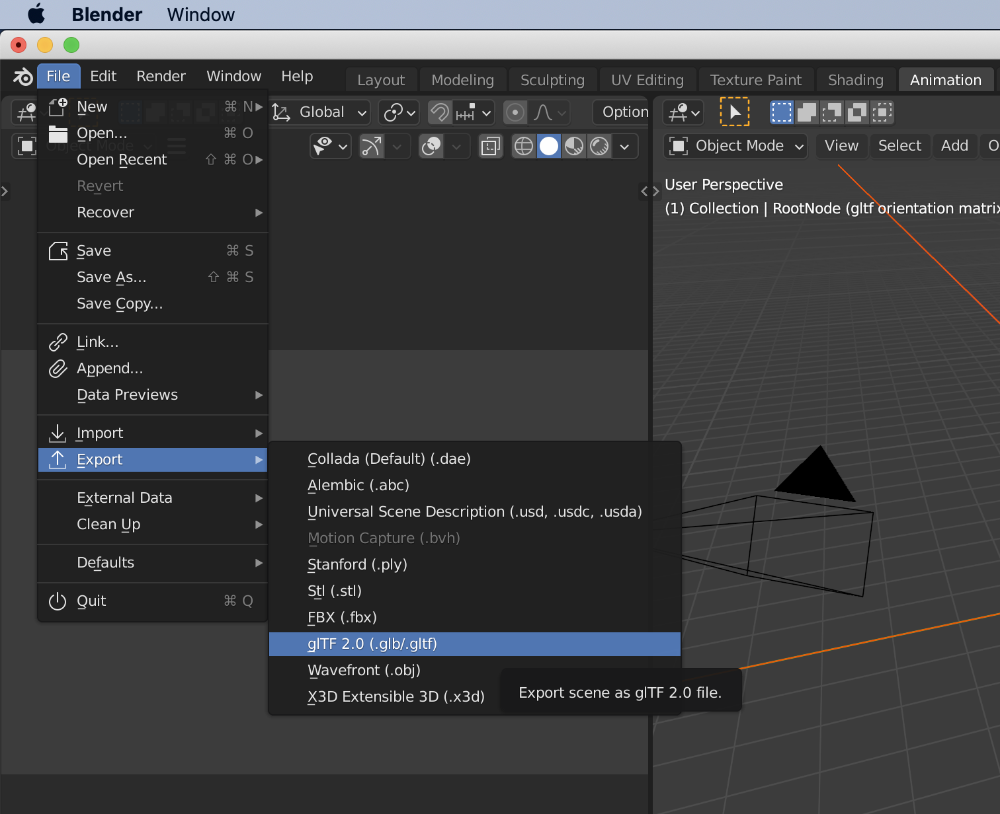

ensure to select to export as **glTF binary.glb**   

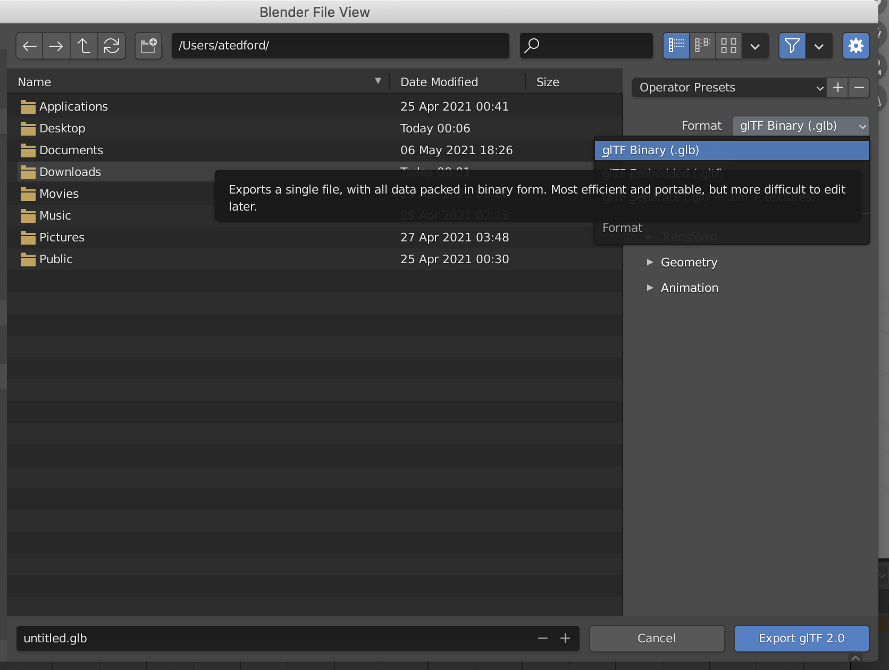

now, put the glb file into the static folder (pay attention! the **static** folder)

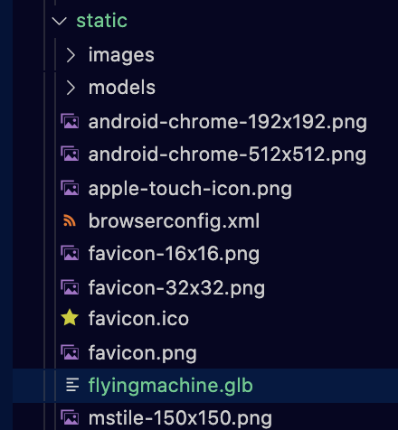

In order for us to use this model in our react-three-fiber scene, we are going to use a tool to convert our flyingmachine.glb into a special version of itself as a Javascript object.  It is this new .js file that we will be using.  To get this process done, navigate to the static folder in Terminal, and enter:
```bash
gltfjsx flyingmachine.glb
```
Here we see that has automatically created Flyingmachine.glb.js for us  


 
For future ease, let's move that file (the .js file, **not** the .glb) into our helpers folder:

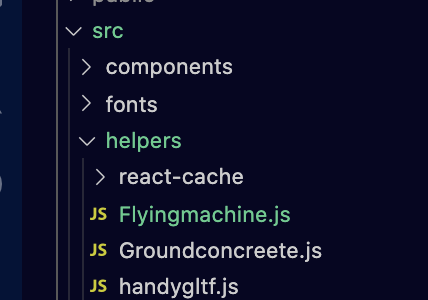  

Great, now edit **index.js** to import the model:

```jsx
import Model from "../../helpers/Flyingmachine.js";
```

and now we can put the "Model" in the scene inside Suspense tags with the Html message 'loading'.  Also note we have placed the model in a group to ensure problem free resizing that doesn't negatively effect the animation:
- the camera and plane were moved a little too..
- Orbitcontrols were also added (dont forget to import OrbitControls from '@react-three/drei';
```jsx
<Canvas camera={{ position: [-7, 3, 20], fov: 30 }} style={{ height: "100%", width: "100%" }}>

  <mesh receiveShadow rotation={[-Math.PI / 2, 0, 0]} position={[0, -1, 0]}>
    <planeBufferGeometry attach="geometry" args={[500, 500]} />
    <meshStandardMaterial attach="material" color="white" />
  </mesh>
  
  <pointLight position={[-10, 20, 20]} intensity={1}/>
  <pointLight position={[10, -10, -10]} intensity={1}/>
  <Stars/>
  <TheCurveThing/> 
  <Suspense fallback={<Html>Loading...</Html>}>    
    <group scale={[.03,.03,.03]}>
        <Model  /> 
    </group>
  </Suspense>
  <OrbitControls/>
</Canvas>
```

a few changes at the top now looks like this
```javascript
import React , {useRef, Suspense} from 'react';
import Layout from "../../components/layoutwide"  
import { Canvas } from "@react-three/fiber"
import { Stars, Html, OrbitControls } from '@react-three/drei';
import * as THREE from 'three'
import Model from "../../helpers/Sentry.js";
 
```

Now our scene shows:

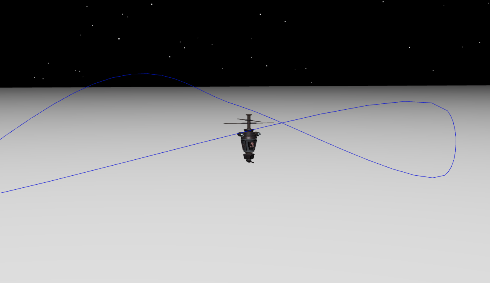 

>You can visit the stand-alone version of this scene <a href="/followcurvedemo">here</a>

# Now, we want to make the model follow the spline path.  

